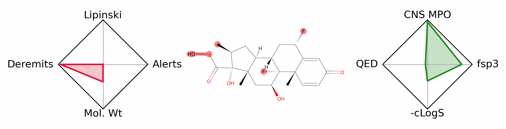

# Introduction

`mol_cv` is a utiity for generating and visualizing 'Molecular CVs' of  desirable and undesireable properties, including all of the properties below:

    H-bond donors
    H-bond acceptors
    Exact mass
    Molecular weight
    Aromatic rings
    Heavy atoms
    Topological polar surface area
    Rotatable bonds
    Chemical formula
    Fraction of carbons SP3 hybridized
    QED
    Brenk alert count
    Brenk explanation
    NIH alert count
    NIH explanation
    PAINS alert count
    PAINS explanation
    log_p
    log_d
    pk_a
    log_s
    Total alert count
    Lipinski violations
    cns_mpo
    Lilly status
    Lilly demerits
    Lilly explanation

# Installation

    git clone https://github.com/prheenan/mol_cv.git
    cd mol_cv
    bash install.sh  # needed to download all the training data
    conda env create --force --yes -f env.yaml
    conda activate mol_cv

# Testing

    conda activate mol_cv
    python test.py

# Usage

## Getting flat file of molecular properties

    python mol_cv.py properties --input_file data/cluster_example.csv --output_file data/cluster_example_output.csv

This should output the relevant data to the following file:

    head -n 2 data/cluster_example_output.csv

    H-bond donors, < ... omitted for readability ... > Lilly explanation
    3, < ... omitted for readabbility ... > 1  matches to 'michael_rejected'

There are many different options, listed below via `python mol_cv.py properties --help`

    Usage: mol_cv.py properties [OPTIONS]

      :param kw: see properties_helper :return: see properties_helper

    Options:
      --input_file FILE               Name of input file (must be csv)  [required]
      --structure_column TEXT         name of the structure column in the file
      --structure_type [MOL|SMILES|INCHI]
                                      How to read the structure column
      --output_file FILE              where to output the file
      --normalize_molecules Choice([TRUE/True/FALSE/False])
                                      Whether to normalize molecule prior to
                                      fitting
      --limit_to TEXT                 CSV of list of allowed properties (see
                                      allowed-properties command). Only calculate
                                      these
      --hard_reject_demerits FLOAT    Demerits to give molecules which lilly rules
                                      'hard reject'
      --help                          Show this message and exit.

For example, if you were just interested in `log_s` and `log_d`, you could write:

    python mol_cv.py properties --limit_to "log_s,log_d" --input_file data/cluster_example.csv --output_file data/cluster_example_output.csv

The resulting file looks like (via `head -n 2 data/cluster_example_output.csv`)

    log_d,log_s
    2.4661894,-4.095603

## Printing available properties

This should print off something like the following

    H-bond donors
    H-bond acceptors
    Exact mass
    Molecular weight
    Aromatic rings
    Heavy atoms
    Topological polar surface area
    Rotatable bonds
    Chemical formula
    Fraction of carbons SP3 hybridized
    QED
    Brenk alert count
    Brenk explanation
    NIH alert count
    NIH explanation
    PAINS alert count
    PAINS explanation
    log_p
    log_d
    pk_a
    log_s
    Total alert count
    Lipinski violations
    cns_mpo
    Lilly status
    Lilly demerits
    Lilly explanation

## Notes

- For Lilly MedChem rules, the Lilly code rejects some atoms without providing a demerit number.
  - My code gives these all demerits of `hard_reject_demerits` (see option above) and sets their status to `Hard reject`.
  - Molecules with demerit scores are given a status of `Reject`
  - Molecules which pass are given a status of `Pass`

## Data sets used

- LogP/LogD from [RTlogD](https://github.com/WangYitian123/RTlogD)
  - > [Wang Y, et al., J Cheminform. 2023 Sep 5;15(1):76. doi: 10.1186/s13321-023-00754-4. PMID: 37670374; PMCID: PMC10478446.](https://jcheminf.biomedcentral.com/articles/10.1186/s13321-023-00754-4)
  - Files: See `lib/RTlogD/original_data`
    - LogP data is compiled from
      - PhysProp
        - > The Physical Properties Database (PHYSPROP) by Syracuse Research Corporation (SRC) https://www.srcinc.com/what-we-do/environmental/ scientific-databases.html
      - NCI open
        - > Ihlenfeldt WD, Voigt JH, Bienfait B, Oellien F, Nicklaus MC (2002) Enhanced CACTVS browser of the open NCI database. J Chem Inf Comput Sci 42:46–57
      - OChem
        - >  Sushko I, Novotarskyi S, Korner R, Pandey AK, Rupp M, Teetz W, Brand- maier S, Abdelaziz A, Prokopenko VV, Tanchuk VY et al (2011) Online chemical modeling environment (OCHEM): web platform for data storage, model development and publishing of chemical information. J Comput Aided Mol Des 25:533–554
      - DiverseDataset
        - >  Martel S, Gillerat F, Carosati E, Maiarelli D, Tetko IV, Mannhold R, Carrupt PA (2013) Large, chemically diverse dataset of logP measurements for benchmarking studies. Eur J Pharm Sci 48:21–29
    - Note LogD is compiled from
      - DB29-data/T-data
        - > Mendez D, Gaulton A, Bento AP, Chambers J, De Veij M, Félix E, Magariños MP, Mosquera JF, Mutowo P, Nowotka M (2019) ChEMBL: towards direct deposition of bioassay data. Nucleic Acids Res 47:D930–D940
      - MoleculeNet/Lipo
        - > Wu Z, Ramsundar B, Feinberg EN, Gomes J, Geniesse C, Pappu AS, Leswing K, Pande V (2018) MoleculeNet: a benchmark for molecular machine learning. Chem Sci 9:513–530
- pKa from [Dissociation-Constants](https://github.com/IUPAC/Dissociation-Constants)
  - > Zheng, Jonathan W. and Lafontant-Joseph, Olivier. (2024) IUPAC Digitized pKa Dataset, v2.2. Copyright © 2024 International Union of Pure and Applied Chemistry (IUPAC), The dataset is reproduced by permission of IUPAC and is licensed under a CC BY-NC 4.0. Access at https://doi.org/10.5281/zenodo.7236453.
  - File: `lib/Dissociation-Constants/iupac_high-confidence_v2_2.csv`
- [Lilly-Medchem-Rules](https://github.com/IanAWatson/Lilly-Medchem-Rules)
  - > "Rules for Identifying Potentially Reactive or Promiscuous Compounds" by Robert F. Bruns and Ian W. Watson, J. Med. Chem. 2012, 55, 9763--9772
- FDA approved drugs from [Zinc20](https://zinc20.docking.org/substances/subsets/fda/)
  - > Irwin, Tang, Young, Dandarchuluun, Wong, Khurelbaatar, Moroz, Mayfield, Sayle, J. Chem. Inf. Model 2020, in press. https://pubs.acs.org/doi/10.1021/acs.jcim.0c00675. You may also wish to cite our previous papers: Sterling and Irwin, J. Chem. Inf. Model, 2015 http://pubs.acs.org/doi/abs/10.1021/acs.jcim.5b00559. Irwin, Sterling, Mysinger, Bolstad and Coleman, J. Chem. Inf. Model, 2012 DOI: 10.1021/ci3001277 or Irwin and Shoichet, J. Chem. Inf. Model. 2005;45(1):177-82 PDF, DOI.
  - File: `data.fda`
- LogS from [AqSolDB](https://www.nature.com/articles/s41597-019-0151-1)
  - > Sorkun, M.C., Khetan, A. & Er, S. AqSolDB, a curated reference set of aqueous solubility and 2D descriptors for a diverse set of compounds. Sci Data 6, 143 (2019). https://doi.org/10.1038/s41597-019-0151-1
  - File: `data/AqSolDB_LogS_curated-solubility-dataset.csv`
- [CNS MPO paper](https://doi.org/10.1021/acschemneuro.6b00029)
  - >  ACS Chem. Neurosci. 2016, 7, 6, 767–775
- [Lipinski violations](https://www.sciencedirect.com/science/article/abs/pii/S0169409X96004231)
  - >Christopher A. Lipinski, et. al, Experimental and computational approaches to estimate solubility and permeability in drug discovery and development settings,  Advanced Drug Delivery Reviews, 1997.
- [PAINS filter](doi:10.1021/jm901137j)
  - > Baell JB, Holloway GA. New Substructure Filters for Removal of Pan Assay Interference Compounds (PAINS) from Screening Libraries and for Their  Exclusion in Bioassays. J Med Chem 53 (2010) 2719Ð40. doi:10.1021/jm901137j.
- [BRENK filter](doi:10.1002/cmdc.200700139)
  - > Brenk R et al. Lessons Learnt from Assembling Screening Libraries for Drug Discovery for Neglected Diseases. ChemMedChem 3 (2008) 435-444. doi:10.1002/cmdc.200700139.
- [NIH filter](doi:10.1021/jm901070c)
  - > Doveston R, et al. A Unified Lead-oriented Synthesis of over Fifty Molecular Scaffolds. Org Biomol Chem 13 (2014) 859Ð65. doi:10.1039/C4OB02287D.
  - > Jadhav A, et al. Quantitative Analyses of Aggregation, Autofluorescence, and Reactivity Artifacts in a Screen for Inhibitors of a Thiol Protease. J Med Chem 53 (2009) 37Ð51. doi:10.1021/jm901070c.
- All other properties from [rdkit](https://rdkit.org/docs/Overview.html)

## TODO:

- Better tuning, especially of LogD predictor
- Speed up caching of predictors
- Add LogD data from the following paper?
  - > [Aliagas, I., Gobbi, A., Lee, ML. et al. Comparison of logP and logD correction models trained with public and proprietary data sets. J Comput Aided Mol Des 36, 253–262 (2022). https://doi.org/10.1007/s10822-022-00450-9](https://doi.org/10.1007/s10822-022-00450-9)
  - This in term is based on [ChEMBL](10.1093/nar/gkad1004) logD data:
    - > Zdrazil B, Felix E, Hunter F, Manners EJ, Blackshaw J, Corbett S, de Veij M, Ioannidis H, Lopez DM, Mosquera JF, Magarinos MP, Bosc N, Arcila R, Kizilören T, Gaulton A, Bento AP, Adasme MF, Monecke P, Landrum GA, Leach AR. The ChEMBL Database in 2023: a drug discovery platform spanning multiple bioactivity data types and time periods. Nucleic Acids Res. 2024 Jan 5;52(D1):D1180-D1192.  doi: 10.1093/nar/gkad1004. PMID: 37933841; PMCID: PMC10767899.
  - This didn't substantially improve the prediction
- Add elemental composition ([CHNO Analysis](https://support.collaborativedrug.com/hc/en-us/articles/115003461383-Chemical-Properties-Calculated-by-CDD-Vault-During-Chemical-Registration))
